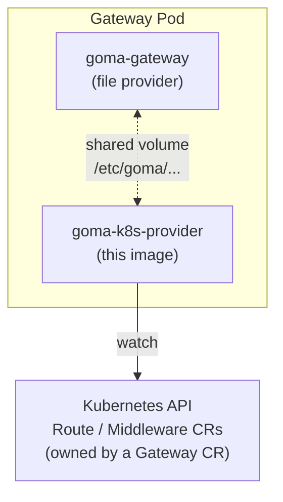

# goma-k8s-provider

A lightweight sidecar that watches Kubernetes `Route` and `Middleware` custom
resources (defined by [Goma Operator](https://github.com/jkaninda/goma-operator)) and materializes them
into a config bundle on disk that [Goma Gateway](https://github.com/jkaninda/goma-gateway)
consumes via its file provider.

It runs alongside the gateway container in the same Pod, giving the gateway
near-instant, restart-free reloads whenever a `Route`/`Middleware` changes.

## How it works



1. The sidecar watches `Route` and `Middleware` CRs scoped to a single
   `Gateway` (by name, via `GOMA_K8S_GATEWAY`).
2. On change, events are debounced and converted into the native Goma Gateway
   config format.
3. The resulting bundle is written atomically to `GOMA_K8S_OUTPUT_DIR`
   (default `/etc/goma/providers/k8s`), where the gateway's file provider
   picks it up and reloads.
4. Optionally, the sidecar also syncs the gateway's ACME store
   (`acme.json`) to a Kubernetes `Secret`, so certificates survive pod
   restarts and rescheduling.

The sidecar is injected automatically by goma-operator unless disabled via:

```yaml
spec:
  providers:
    kubernetes:
      enabled: false
```

## Configuration

All configuration is via environment variables.

| Variable                 | Required | Default                          | Description                                                                 |
| ------------------------ | -------- | -------------------------------- | --------------------------------------------------------------------------- |
| `GOMA_K8S_GATEWAY`       | yes      | —                                | Name of the `Gateway` CR this sidecar serves.                               |
| `GOMA_K8S_NAMESPACE`     | no       | all namespaces                   | Namespace to watch. Leave empty for cluster-wide.                           |
| `GOMA_K8S_OUTPUT_DIR`    | no       | `/etc/goma/providers/k8s`        | Directory where the generated config bundle is written.                     |
| `GOMA_K8S_DEBOUNCE_MS`   | no       | `500`                            | Debounce window for coalescing rapid CR changes (milliseconds).             |
| `GOMA_K8S_ACME_SECRET`   | no       | —                                | Name of a `Secret` to mirror `acme.json` into. Empty disables ACME sync.    |
| `GOMA_K8S_ACME_FILE`     | no       | `/etc/letsencrypt/acme.json`     | Path to the gateway's ACME store inside the shared volume.                  |
| `GOMA_K8S_LOG_LEVEL`     | no       | `info`                           | One of `debug`, `info`, `warn`, `error`.                                    |

## RBAC

The sidecar needs read access to `routes` and `middlewares` in the watched
namespace(s), plus read/write on the ACME `Secret` (when ACME sync is
enabled). When installed via goma-operator, these permissions are granted
automatically.

Minimal rules:

```yaml
- apiGroups: ["gateway.jkaninda.dev"]
  resources: ["routes", "middlewares"]
  verbs: ["get", "list", "watch"]
- apiGroups: [""]
  resources: ["secrets"]
  verbs: ["get", "create", "update", "patch"]
```

## Running locally

The sidecar falls back to `$HOME/.kube/config` when not running in-cluster:

```sh
export GOMA_K8S_GATEWAY=ingress
export GOMA_K8S_NAMESPACE=default
export GOMA_K8S_OUTPUT_DIR=/tmp/goma-k8s
export GOMA_K8S_LOG_LEVEL=debug

go run ./cmd
```

## Build

```sh
make build            # local binary
make docker-build     # container image
```

## Related Projects

- **[Goma Gateway](https://github.com/jkaninda/goma-gateway)** — Cloud-native API Gateway
- **[Goma HTTP Provider](https://github.com/jkaninda/goma-http-provider)** — Goma Operator
- **[Goma Operator](https://github.com/jkaninda/goma-operator)** — Kubernetes Operator for Goma Gateway
- **[Goma Admin](https://github.com/jkaninda/goma-admin)** — Control Plane for Goma Gateway — Manage, configure, and monitor distributed Goma Gateway.


## License

This project is licensed under the Apache-2.0. 


## Support

- Email: meAtjkaninda.dev
- LinkedIn: [LinkedIn](https://www.linkedin.com/in/jkaninda)

---

Copyright 2026 **Jonas Kaninda**
